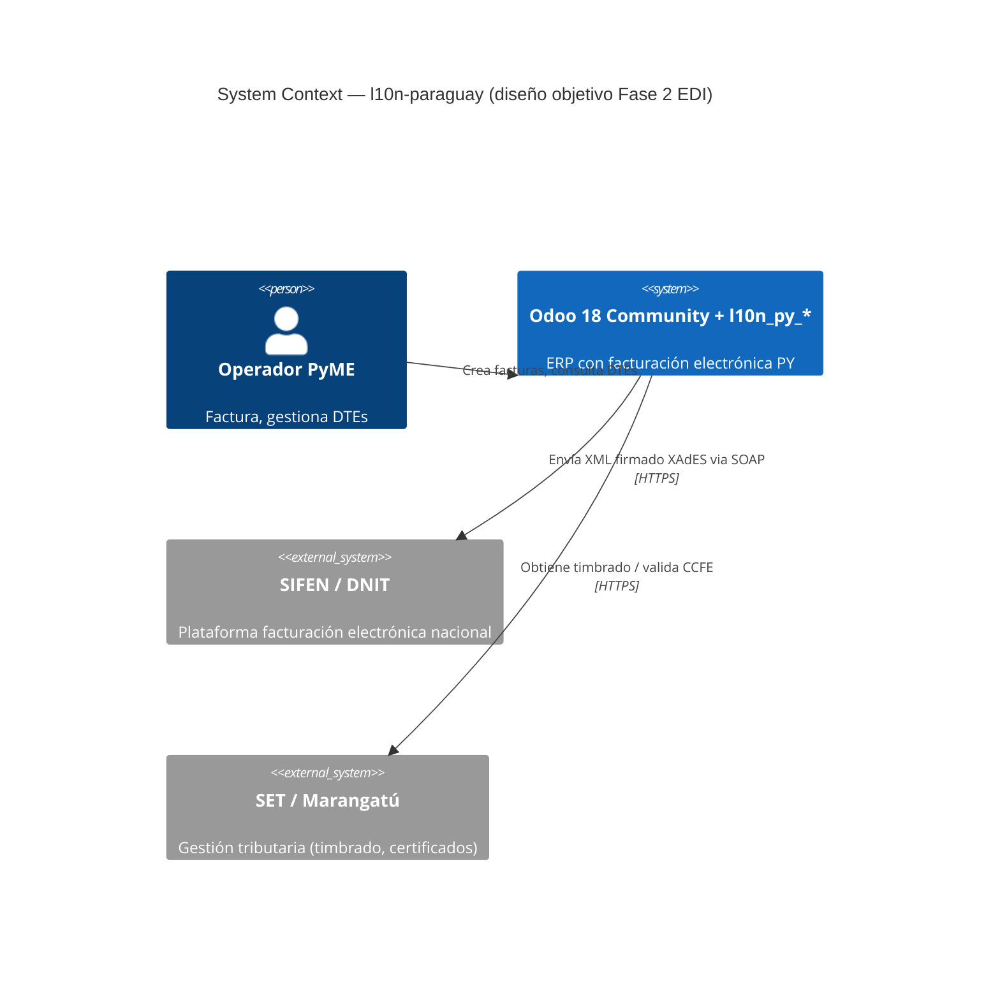

# Phase 3: Bloque C — Documentación operacional - Pattern Map

**Mapped:** 2026-06-05
**Files analyzed:** 18 new/modified files
**Analogs found:** 17 / 18

---

## File Classification

| New/Modified File                                      | Role               | Data Flow | Closest Analog                                    | Match Quality                                      |
| ------------------------------------------------------ | ------------------ | --------- | ------------------------------------------------- | -------------------------------------------------- |
| `README.md` (rewrite)                                  | doc / meta         | static    | `references/l10n-brazil/README.md`                | role-match (OCA-style repo root README)            |
| `CHANGELOG.md` (new)                                   | doc / meta         | static    | `CHANGES.rst` (migrate from)                      | partial (same changelog concept, different format) |
| `CONTRIBUTING.md` (new)                                | doc / meta         | static    | `references/odoo-18.0/CONTRIBUTING.md`            | partial (contributor guide structure)              |
| `CODE_OF_CONDUCT.md` (new)                             | doc / meta         | static    | `SECURITY.md` (channel/contact pattern)           | partial (governance contact pattern)               |
| `docs/65_FASE_1_RETROSPECTIVA.md` (rename from `60_`)  | doc                | static    | itself (`docs/60_FASE_1_RETROSPECTIVA.md`)        | exact (rename only)                                |
| `docs/70_ARCHITECTURE.md` (new)                        | doc / architecture | static    | `docs/60_SECURITY_BASELINE.md`                    | role-match (blueprint-style operational doc)       |
| `docs/71_DEPLOYMENT.md` (new)                          | doc / operations   | static    | `docs/60_SECURITY_BASELINE.md`                    | exact (same blueprint style + markers)             |
| `docs/72_RUNBOOK.md` (new)                             | doc / operations   | static    | `docs/60_SECURITY_BASELINE.md`                    | role-match (operational doc with snippet blocks)   |
| `docs/adr/README.md` (new)                             | doc / meta         | static    | `docs/README.md`                                  | role-match (index/nav doc in docs/)                |
| `docs/adr/0001-odoo-community.md` (new)                | doc / decision     | static    | none in-repo                                      | no analog (Nygard ADR — use RESEARCH.md pattern)   |
| `docs/adr/0002-oca-style-from-day-one.md` (new)        | doc / decision     | static    | none in-repo                                      | no analog (Nygard ADR)                             |
| `docs/adr/0003-dnit-catalogs-source-of-truth.md` (new) | doc / decision     | static    | none in-repo                                      | no analog (Nygard ADR)                             |
| `docs/adr/0004-multi-rubro-strategy.md` (new)          | doc / decision     | static    | none in-repo                                      | no analog (MADR stub)                              |
| `docs/adr/0005-hosting-strategy.md` (new)              | doc / decision     | static    | none in-repo                                      | no analog (MADR with options)                      |
| `.pre-commit-config.yaml` (add hook)                   | config / tooling   | static    | itself (current `.pre-commit-config.yaml`)        | exact (add entry to existing block)                |
| `addons/l10n_py_base/README.rst` (regenerated)         | doc / addon        | static    | itself (current `addons/l10n_py_base/README.rst`) | exact (regenerated by hook)                        |
| `addons/l10n_py_account/README.rst` (regenerated)      | doc / addon        | static    | `addons/l10n_py_base/README.rst`                  | exact (same fragment structure)                    |
| `CHANGES.rst` (delete)                                 | doc / meta         | static    | `CHANGELOG.md` (becomes)                          | — (deletion)                                       |

---

## Pattern Assignments

### `README.md` (rewrite — OCA-style evaluator-first)

**Analog:** `references/l10n-brazil/README.md`

**Badge header pattern** (lines 1-9 of current `README.md` — KEEP AS-IS):

```markdown
[](...)
[](...)
[](...)
[](...)
[](...)
[](...)
```

**OCA addon table pattern** (from `references/l10n-brazil/README.md` lines 23-55 — adapt to PY):

```markdown
## Available modules

| Module                                       | Version    | Summary                                                                        |
| -------------------------------------------- | ---------- | ------------------------------------------------------------------------------ |
| [`l10n_py_base`](addons/l10n_py_base/)       | 18.0.1.1.0 | Foundational PY localization: DNIT/SIFEN catalogs, RUC/CI validation, 23 tests |
| [`l10n_py_account`](addons/l10n_py_account/) | 18.0.1.0.0 | Chart of accounts, IVA taxes, document types, timbrado, 74 tests               |
| `l10n_py_edi`                                | planned    | XML SIFEN, XAdES signature, SOAP DNIT, CDC, KuDE, events                       |
| `l10n_py_reports`                            | planned    | IVA books, Hechauka, RG90                                                      |
| `l10n_py_pos`                                | planned    | POS with SIFEN integration                                                     |
| `l10n_py_withholding`                        | planned    | IVA / IRE / IRP withholdings                                                   |
```

Note: No "TODO" in shipped rows — use real versions (18.0.1.1.0, 18.0.1.0.0).

**Quick start pattern** (based on `infra/docker-compose.yml` — replace current venv-first block):

````markdown
## Quick start

```bash
# 1. Clone
git clone https://github.com/Ezcareaga/l10n-paraguay
cd l10n-paraguay

# 2. Start dev environment
docker compose -f infra/docker-compose.yml up -d

# 3. Create database
# Open http://localhost:8069 → Create database
# Name: l10n_py_dev | Country: Paraguay | Language: Spanish | Demo data: NO

# 4. Install modules
# Apps → search "l10n_py_base" → Install
# Apps → search "l10n_py_account" → Install

# 5. Login
# admin / admin (change on first login)
```
````

For development setup (pre-commit, references, codegraph) → see [CONTRIBUTING.md](CONTRIBUTING.md).

````

**Links to docs pattern** (from current README lines 62-67 — restructure):
```markdown
## Documentation

| Audience | Starting point |
| --- | --- |
| Evaluator / OCA reviewer | [docs/00_OBJECTIVE.md](docs/00_OBJECTIVE.md) |
| Developer | [CONTRIBUTING.md](CONTRIBUTING.md) |
| Operator / deployer | [docs/71_DEPLOYMENT.md](docs/71_DEPLOYMENT.md) |
| SIFEN implementer | [docs/01_SIFEN_KNOWLEDGE_BASE.md](docs/01_SIFEN_KNOWLEDGE_BASE.md) |
| Architecture overview | [docs/70_ARCHITECTURE.md](docs/70_ARCHITECTURE.md) |
````

---

### `CHANGELOG.md` (new — Keep a Changelog 1.1.0)

**Analog:** `CHANGES.rst` (migrate content from; then delete)

**Existing content to migrate** (from `CHANGES.rst` lines 1-10):

- "Initial CI sanity check (Phase 1 of milestone Pre-Fase 2 Foundation)" → fold into [0.1.0] Changed section

**Keep a Changelog structure pattern** (from RESEARCH.md Code Examples section):

```markdown
# Changelog

All notable changes to this project will be documented in this file.

The format is based on [Keep a Changelog](https://keepachangelog.com/en/1.1.0/).

## [Unreleased]

## [0.1.0] - Unreleased (see Phase 4 REL-05 for tag date)

### Added

- `l10n_py_base 18.0.1.1.0` — Paraguayan localization base module: SIFEN/DNIT
  catalogs (departments, districts, cities, economic regimes, taxpayer types),
  `l10n_py.timbrado` model, `res.company` PY fiscal extension, RUC/CI validation
  (módulo 11 algorithm), 23 tests
- `l10n_py_account 18.0.1.0.0` — Chart of accounts, IVA taxes (10%/5%/exenta),
  `l10n_latam.document.type` records for Paraguay (FE/NC/ND/NR),
  `account.journal` timbrado extension, 74 tests
- CI/CD pipeline: GitHub Actions lint + test (OCA py3.10/PG12 matrix) +
  commitlint + dependabot
- Security workflow: gitleaks (secret scanning) + Bandit (SAST) +
  Dependency Review
- `SECURITY.md` — vulnerability reporting channel (GitHub Advisories + email)
- `docs/60_SECURITY_BASELINE.md` — 6-axis security blueprint
- `docs/61_COMPLIANCE_LEY_7593.md` — Ley 7593/2025 compliance framework

### Changed

- Branch protection on `main` — PR required, 6 status checks enforced
- `README.md` restructured to OCA-style evaluator-first format

[0.1.0]: https://github.com/Ezcareaga/l10n-paraguay/releases/tag/v0.1.0
```

---

### `CONTRIBUTING.md` (new — 6 ejes + DOC-09 + migrated from README)

**Analog:** `references/odoo-18.0/CONTRIBUTING.md` (structure only — content is project-specific)

**Dev environment setup section** (content sourced from `infra/docker-compose.yml` + current `README.md` lines 37-54):

````markdown
## Development setup

### Prerequisites

- Docker 24+ and Docker Compose v2
- Python 3.11+ (for pre-commit tooling)
- git 2.40+

### First-time setup

```bash
# Clone
git clone https://github.com/Ezcareaga/l10n-paraguay
cd l10n-paraguay

# Start Odoo + Postgres
docker compose -f infra/docker-compose.yml up -d

# Create dev DB (browser)
# http://localhost:8069 → Create database
# Name: l10n_py_dev | Country: Paraguay | Demo: NO

# Install pre-commit hooks
pip install pre-commit
pre-commit install

# (Optional) codegraph for references/
python scripts/build_index.py
```
````

### CI environment vs local runtime

> The GitHub Actions CI matrix uses `ghcr.io/oca/oca-ci/py3.10-odoo18.0:latest`
> (Python 3.10, PostgreSQL 12). Local development uses the `odoo:18.0` image
> (Python 3.12) with `postgres:16`. Both are supported.
>
> If a test passes locally but fails in CI, check for Python 3.10/3.12 syntax
> differences or PostgreSQL version-specific behavior (JSON operators, etc.).

````

**Conventional Commits + branch naming pattern** (from CLAUDE.md global):
```markdown
## Branch naming

````

feature/_ | fix/_ | refactor/_ | docs/_ | chore/\*

```

Branch from `main`. Keep branches open < 48h.

## Commit messages

Follow [Conventional Commits](https://www.conventionalcommits.org/):

- `feat(l10n_py_base): add economic_activity model`
- `fix(timbrado): correct expiry_date validation`
- `docs(contributing): add ADR rule`
- `test(l10n_py_account): cover journal timbrado extension`
- `chore(pre-commit): activate oca-gen-addon-readme baseline`
```

**ADR rule (DOC-09) section**:

```markdown
## Architectural changes

Any change to module structure, data model design, or integration strategy
requires an ADR in `docs/adr/` **in the same PR**. Create a new ADR file
following the template in [`docs/adr/README.md`](docs/adr/README.md) and
link it from the PR description.

ADRs use status `Proposed` at merge time; the maintainer changes it to
`Accepted` after review.
```

**Testing section**:

````markdown
## Testing

- Minimum 80% line coverage for new logic in `models/` and `tools/`.
- Unit tests in `tests/test_*.py` using `TransactionCase`.
- Run before every commit:
  ```bash
  docker compose -f infra/docker-compose.yml exec odoo \
    odoo --test-enable --stop-after-init -d l10n_py_dev \
    --test-tags=l10n_py -i l10n_py_base,l10n_py_account
  ```
````

````

---

### `CODE_OF_CONDUCT.md` (new — Contributor Covenant 2.1)

**Analog:** `SECURITY.md` (contact pattern — same enforcement email)

**Contact placeholder pattern** (from `SECURITY.md` lines 17-18):
```markdown
# Source of enforcement contact:
# SECURITY.md fallback email: careagaezz@gmail.com
# Subject convention: [SECURITY] in SECURITY.md → [CoC] for CoC reports

# Fill CC 2.1 template exactly ONE placeholder:
# [INSERT CONTACT METHOD] → careagaezz@gmail.com
````

**Verification grep** after writing:

```bash
grep "INSERT CONTACT" CODE_OF_CONDUCT.md || echo "OK — placeholder replaced"
```

---

### `docs/65_FASE_1_RETROSPECTIVA.md` (rename from `docs/60_FASE_1_RETROSPECTIVA.md`)

**Analog:** itself — file content unchanged, only path changes.

**Link locations that must be updated** (from RESEARCH.md Runtime State Inventory):

- `CLAUDE.md` line 122: `docs/60_FASE_1_RETROSPECTIVA.md` → `docs/65_FASE_1_RETROSPECTIVA.md`
- `.planning/PROJECT.md` — search for `60_FASE_1`
- `AGENTS.md` — search for `60_FASE_1`
- `.planning/phases/01-bloque-a-.../01-CONTEXT.md` — search for `60_FASE_1`

**Grep audit command before rename**:

```bash
grep -r "60_FASE_1_RETROSPECTIVA" . \
  --include="*.md" --include="*.yaml" --include="*.yml" \
  -l
```

---

### `docs/70_ARCHITECTURE.md` (new — C4 + sequence + state machine)

**Analog:** `docs/60_SECURITY_BASELINE.md` (same document role: technical blueprint, Spanish, tables + code blocks)

**Document header pattern** (from `docs/60_SECURITY_BASELINE.md` lines 1-8 and `docs/61_COMPLIANCE_LEY_7593.md` lines 1-7):

```markdown
# Arquitectura — l10n-paraguay

**Estado:** diseño objetivo (Fase 2 EDI pending)
**Vigencia:** actualizar al mergear cada phase que cambie la arquitectura
**Cross-ref:** [`docs/50_MODULES_ROADMAP.md`](50_MODULES_ROADMAP.md) (módulos planned/shipped),
[`docs/03_DOMAIN_MODEL.md`](03_DOMAIN_MODEL.md) (modelo de dominio detallado)

---
```

**Section structure pattern** (from `docs/60_SECURITY_BASELINE.md` — use same top-level headings):

```markdown
## Alcance del documento

## [Diagram section 1: C4 Context]

## [Diagram section 2: C4 Container]

## [Diagram section 3: Sequence FE emission]

## [Diagram section 4: DTE lifecycle state machine]

## Cross-references
```

**C4 Context diagram pattern** (from RESEARCH.md Code Examples Pattern 5):

````markdown

````

````

**State machine pattern** (from RESEARCH.md Code Examples — DTE lifecycle):
```markdown
```mermaid
stateDiagram-v2
    [*] --> draft : account.move created
    draft --> posted : action_post()
    posted --> to_send : action_send_and_print()
    to_send --> sent : SIFEN aprueba (edi_state=sent)
    to_send --> error : SIFEN rechaza (edi_state=error)
    error --> to_send : retry
    sent --> cancelled : evento de cancelación SIFEN

    note right of sent
        Diseño objetivo — Fase 2 EDI
        (l10n_py_edi no existe aún)
    end note
````

````

**Shipped/planned marker pattern** (from C4 Container — match `docs/50_MODULES_ROADMAP.md` states):
```markdown
# In the C4 Container diagram, mark each module explicitly:
# - shipped: l10n_py_base (18.0.1.1.0), l10n_py_account (18.0.1.0.0)
# - planned: l10n_py_edi, l10n_py_reports, l10n_py_pos, l10n_py_withholding
#
# Label pattern for planned modules: "l10n_py_edi [planned — Fase 2]"
````

---

### `docs/71_DEPLOYMENT.md` (new — blueprint + markers)

**Analog:** `docs/60_SECURITY_BASELINE.md` — exact match (same blueprint style, same marker convention, same structure)

**Document header pattern** (lines 1-8 of `docs/60_SECURITY_BASELINE.md`):

```markdown
# Deployment — l10n-paraguay

**Estado:** blueprint pre-deploy (Pre-Fase 3)
**Vigencia:** Pre-Fase 3 — cuando exista deploy real, validar comandos contra entorno
**Cross-ref:** ver [`docs/60_SECURITY_BASELINE.md`](60_SECURITY_BASELINE.md) §Backup y §Red para detalles de seguridad

---
```

**Section/eje pattern** (from `docs/60_SECURITY_BASELINE.md` — each eje follows: ### Qué hacemos / Por qué / Comandos ilustrativos / marker):

````markdown
## VPS y sistema operativo

### Qué hacemos

[1-3 bullet points describing what is done]

### Por qué

[1 paragraph justification]

### Comandos ilustrativos

```bash
# Ejemplo — ajustar al VPS real
```
````

> Note: validar en Pre-Fase 3 cuando exista deploy real

```

**Validation-deferred marker pattern** (from `docs/60_SECURITY_BASELINE.md` lines 83, 136, 207 — exact text):
```

> Note: validar en Pre-Fase 3 cuando exista deploy real

````

**docker-compose prod as code block** (inline only — do NOT commit as separate file):
```markdown
## docker-compose de producción (referencia)

El siguiente bloque es ilustrativo. No existe como archivo commiteado —
ajustar al VPS real en Pre-Fase 3.

```yaml
# docker-compose.prod.yml (código de referencia — no commiteado)
services:
  postgres:
    image: postgres:16
    # ... production settings
  odoo:
    image: odoo:18.0
    # ... production settings with --no-dev
````

> Note: validar en Pre-Fase 3 cuando exista deploy real

````

**Cross-reference pattern** (from `docs/60_SECURITY_BASELINE.md` lines 651-655):
```markdown
## Cross-references

- Seguridad de red y backup: [`docs/60_SECURITY_BASELINE.md`](60_SECURITY_BASELINE.md)
- Compliance datos personales: [`docs/61_COMPLIANCE_LEY_7593.md`](61_COMPLIANCE_LEY_7593.md)
- Runbook de incidentes: [`docs/72_RUNBOOK.md`](72_RUNBOOK.md)
- Script restore test: [`scripts/restore-smoke.sh`](../scripts/restore-smoke.sh)
````

---

### `docs/72_RUNBOOK.md` (new — 10 incidents + escalation path)

**Analog:** `docs/60_SECURITY_BASELINE.md` (blueprint style) + domain knowledge from `docs/01_SIFEN_KNOWLEDGE_BASE.md`

**Document header pattern**:

```markdown
# Runbook operacional — l10n-paraguay

**Estado:** baseline operacional (Pre-Fase 3)
**Vigencia:** incidentes SIFEN-dependientes se validan en Fase 2 EDI / homologación
**Cross-ref:** [`docs/60_SECURITY_BASELINE.md`](60_SECURITY_BASELINE.md),
[`docs/71_DEPLOYMENT.md`](71_DEPLOYMENT.md)

---
```

**Incident template pattern** (from RESEARCH.md Code Examples Pattern 4 — exact template):

````markdown
### Incidente N: [Nombre corto]

**Síntoma:** [lo que el operador observa]
**Severidad:** Alta / Media / Baja — [criterio: impacto en facturación / datos]

**Diagnóstico:**

```bash
# Comandos copy-paste para confirmar causa
```
````

**Resolución:**

1. Paso 1
2. Paso 2

**Prevención:** [qué configura/monitorea para evitarlo]

> Note: procedimiento se valida en Fase 2 EDI / homologación.

````
(Add the SIFEN-deferral note ONLY on incidents 1, 4, 5, 7, 10.)

**Escalation path section** (at end of doc, single instance):
```markdown
## Escalation path

| Nivel | Rol | Canal | SLA orientativo |
| --- | --- | --- | --- |
| N1 | Operador del deploy | Panel Odoo / logs VPS | Inmediato |
| N2 | Careaga Dev | careagaezz@gmail.com / WhatsApp | Respuesta < 4h hábiles |
| N3 | Externo | Mesa ayuda SIFEN/DNIT, soporte VPS provider, comunidad OCA | Variable |
````

**Backup cross-ref pattern** (from `docs/60_SECURITY_BASELINE.md` line 228-229):

```markdown
# For incidente 8 (restore backup fails), reference:

Ver procedimiento completo de backup → [`docs/60_SECURITY_BASELINE.md`](60_SECURITY_BASELINE.md) §4 Backup.
Ver script: [`scripts/restore-smoke.sh`](../scripts/restore-smoke.sh)
```

---

### `docs/adr/README.md` (new — explains hybrid Nygard/MADR)

**Analog:** `docs/README.md` (index doc pattern in docs/)

**Pattern** (from `docs/README.md` — section listing style):

```markdown
# Architecture Decision Records

Este directorio contiene los ADRs del proyecto `l10n-paraguay`.

## Formato

| ADRs                     | Formato           | Criterio                                           |
| ------------------------ | ----------------- | -------------------------------------------------- |
| 0001–0003 (retroactivos) | Nygard liviano    | Sin opciones consideradas honestas a posteriori    |
| 0004–0005 (prospectivos) | MADR con opciones | Opciones reales que un lector futuro debe entender |

...
```

---

### `docs/adr/0001-odoo-community.md`, `0002-oca-style-from-day-one.md`, `0003-dnit-catalogs-source-of-truth.md` (new — Nygard liviano)

**Analog:** none in-repo. Use RESEARCH.md Pattern 1 (Nygard Lightweight ADR) verbatim.

**Nygard liviano template** (from RESEARCH.md Code Examples Pattern 1):

```markdown
# ADR-000N: [Título corto]

**Status:** Accepted
**Date:** 2026-05-19
**Refs:** [relevant docs]

## Context

[Why the situation existed that made a decision necessary — 2-4 sentences]

## Decision

[The choice made — 1-2 sentences, unambiguous]

## Consequences

- [Consequence 1 — positive or neutral]
- [Consequence 2]
- [Constraint accepted]
```

**Content sources for each ADR:**

- ADR-0001: `docs/00_OBJECTIVE.md` + `docs/50_MODULES_ROADMAP.md` (Odoo Community rationale)
- ADR-0002: `docs/20_OCA_GUIDELINES.md` + `docs/21_OCA_DEVELOPMENT_BOOK.md` (OCA-style rationale)
- ADR-0003: `docs/01_SIFEN_KNOWLEDGE_BASE.md` + `docs/02_SIFEN_REFERENCIA_COMPLETA.md` (DNIT catalogs rationale)

---

### `docs/adr/0004-multi-rubro-strategy.md` (new — MADR stub Proposed)

**Analog:** none in-repo. Use RESEARCH.md Pattern 2 (MADR) with stub content.

**MADR stub template** (from RESEARCH.md Code Examples Pattern 2 — exact YAML frontmatter + structure):

```markdown
---
status: proposed
date: 2026-06-05
decision-makers: ["@Ezcareaga"]
---

# ADR-0004: Estrategia multi-rubro

## Context and Problem Statement

...

## Decision Drivers

...

## Considered Options

- Opción A: ...
- Opción B: ...

## Decision Outcome

**Propuesto:** Opción B. [Phase 5 IND-01 completa este análisis → status: Accepted]

## Consequences

...
```

---

### `docs/adr/0005-hosting-strategy.md` (new — MADR with options)

**Analog:** none in-repo. Same MADR format as 0004. Status: `proposed`.

**Hosting options to compare** (from RESEARCH.md Open Questions section):

- Hetzner CX21 (~EUR 5/mo, Frankfurt/Nürnberg DC)
- Contabo VPS S (~EUR 4/mo, similar specs)
- 1 Paraguayan provider (Telecel Cloud or similar)

**Decision-makers field**: `["@Ezcareaga"]`

---

### `.pre-commit-config.yaml` (add `oca-gen-addon-readme` hook)

**Analog:** itself — add one hook ID to existing `maintainer-tools` repo block.

**Existing block to modify** (`.pre-commit-config.yaml` lines 37-41 — exact current state):

```yaml
- repo: https://github.com/oca/maintainer-tools
  rev: b89f767503be6ab2b11e4f50a7557cb20066e667
  hooks:
    - id: oca-fix-manifest-website
      args: ["https://github.com/Ezcareaga/l10n-paraguay"]
```

**Change to apply** (from RESEARCH.md Code Examples — oca-gen-addon-readme entry):

```yaml
- repo: https://github.com/oca/maintainer-tools
  rev: b89f767503be6ab2b11e4f50a7557cb20066e667
  hooks:
    - id: oca-fix-manifest-website
      args: ["https://github.com/Ezcareaga/l10n-paraguay"]
    - id: oca-gen-addon-readme # ADD — D-07
```

**Global exclude caveat** (from `.pre-commit-config.yaml` lines 9-20 — `^README\.rst$` in exclude block):

- The global `exclude` block contains `^README\.rst$` (anchored — matches bare path only, not `addons/*/README.rst`)
- The `trailing-whitespace` and `end-of-file-fixer` hooks exclude `/README\.rst$` (suffix match)
- `oca-gen-addon-readme` writes to `addons/l10n_py_base/README.rst` and `addons/l10n_py_account/README.rst` — these are NOT matched by the global `^README\.rst$` anchor
- No additional exclude needed; the hook runs with no file list (`pass_filenames: false` per hook definition)

---

### `addons/l10n_py_base/README.rst` and `addons/l10n_py_account/README.rst` (regenerated)

**Analog:** themselves — current versions are the baseline; hook regenerates from `readme/` fragments.

**Current fragment structure** (verified in `addons/l10n_py_base/readme/`):

- `DESCRIPTION.rst` — exists
- `USAGE.rst` — exists
- `CONTRIBUTORS.rst` — exists
- `CREDITS.rst` — exists
- `CHANGES.rst` — exists (per-addon history per OCA convention)

**For `addons/l10n_py_account/readme/`:**

- `DESCRIPTION.rst` — exists
- `USAGE.rst` — exists
- `CONFIGURE.rst` — exists
- `ROADMAP.rst` — exists
- `CHANGES.rst` — exists

**Regeneration commit pattern** (from CONTEXT.md D-07 + RESEARCH.md):

```
chore(pre-commit): activate oca-gen-addon-readme baseline

Activar hook oca-gen-addon-readme en .pre-commit-config.yaml y absorber
el diff cosmético inicial de README.rst en ambos addons.

- .pre-commit-config.yaml: sumar id oca-gen-addon-readme al bloque maintainer-tools
- addons/l10n_py_base/README.rst: regenerado
- addons/l10n_py_account/README.rst: regenerado
```

---

## Shared Patterns

### Blueprint-style operational doc structure

**Source:** `docs/60_SECURITY_BASELINE.md` lines 1-8, 32-35, 74-84
**Apply to:** `docs/70_ARCHITECTURE.md`, `docs/71_DEPLOYMENT.md`, `docs/72_RUNBOOK.md`

Header block:

```markdown
# [Título] — l10n-paraguay

**Estado:** [estado actual]
**Vigencia:** [cuándo revisar]
**Cross-ref:** [links a docs relacionados]

---

## Alcance del documento

[1-2 párrafos definiendo scope y audiencia]
```

### Validation-deferred marker

**Source:** `docs/60_SECURITY_BASELINE.md` — appears at lines 83, 136, 207, 299, 575, 631 (every snippet block)
**Apply to:** `docs/71_DEPLOYMENT.md` (all snippet blocks), `docs/72_RUNBOOK.md` (SIFEN-dependent incidents 1, 4, 5, 7, 10)

Exact text:

```
> Note: validar en Pre-Fase 3 cuando exista deploy real
```

For RUNBOOK SIFEN incidents variant:

```
> Note: procedimiento se valida en Fase 2 EDI / homologación.
```

### Cross-references block at end of doc

**Source:** `docs/60_SECURITY_BASELINE.md` lines 651-655
**Apply to:** All new docs/7x files and ADRs

```markdown
## Cross-references

- [Texto descriptivo]: [`docs/XX_NOMBRE.md`](XX_NOMBRE.md)
```

### English meta-file header (raíz)

**Source:** `SECURITY.md` lines 1-3 (clean English, no frontmatter)
**Apply to:** `README.md`, `CHANGELOG.md`, `CONTRIBUTING.md`, `CODE_OF_CONDUCT.md`

No YAML frontmatter, no `---` separator — plain Markdown `# H1` first line.

### Conventional Commit type for docs

**Source:** `CLAUDE.md` (global) + RESEARCH.md Constraints table
**Apply to:** All commit messages for this phase

```
docs(readme): rewrite evaluator-first per D-02
docs(changelog): add [0.1.0] unreleased entry
docs(contributing): 6-axis contributor guide + ADR rule
docs(coc): add Contributor Covenant 2.1
docs(architecture): C4 + sequence + state machine diagrams
docs(deployment): VPS blueprint with pre-fase-3 markers
docs(runbook): 10 incidents + escalation path
docs(adr): add 0001-0005 hybrid Nygard/MADR ADRs
chore(pre-commit): activate oca-gen-addon-readme baseline
chore(docs): rename 60_FASE_1_RETROSPECTIVA to 65_ (D-05)
```

---

## No Analog Found

Files with no close match in the codebase (planner uses RESEARCH.md patterns instead):

| File                                             | Role           | Data Flow | Reason                                                                           |
| ------------------------------------------------ | -------------- | --------- | -------------------------------------------------------------------------------- |
| `docs/adr/0001-odoo-community.md`                | doc / decision | static    | No ADRs exist in this repo yet; use Nygard template from RESEARCH.md Pattern 1   |
| `docs/adr/0002-oca-style-from-day-one.md`        | doc / decision | static    | Same — no ADR precedent in-repo                                                  |
| `docs/adr/0003-dnit-catalogs-source-of-truth.md` | doc / decision | static    | Same — no ADR precedent in-repo                                                  |
| `docs/adr/0004-multi-rubro-strategy.md`          | doc / decision | static    | MADR stub; use RESEARCH.md Pattern 2                                             |
| `docs/adr/0005-hosting-strategy.md`              | doc / decision | static    | MADR with options; use RESEARCH.md Pattern 2 + Open Questions §1 for VPS options |

---

## Metadata

**Analog search scope:** repo root (`*.md`, `*.rst`, `*.yaml`), `docs/`, `addons/*/readme/`, `infra/`, `references/l10n-brazil/README.md`, `references/odoo-18.0/CONTRIBUTING.md`
**Files scanned:** 18 target files classified; 8 existing analogs read in full
**Pattern extraction date:** 2026-06-05
