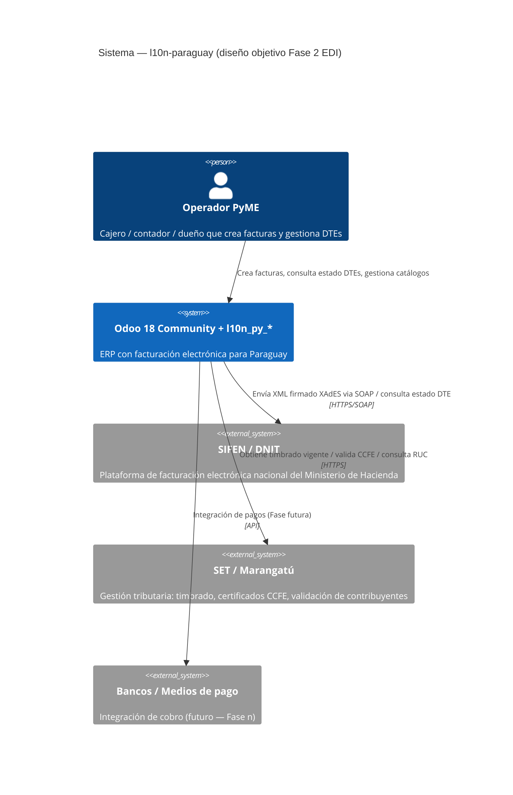
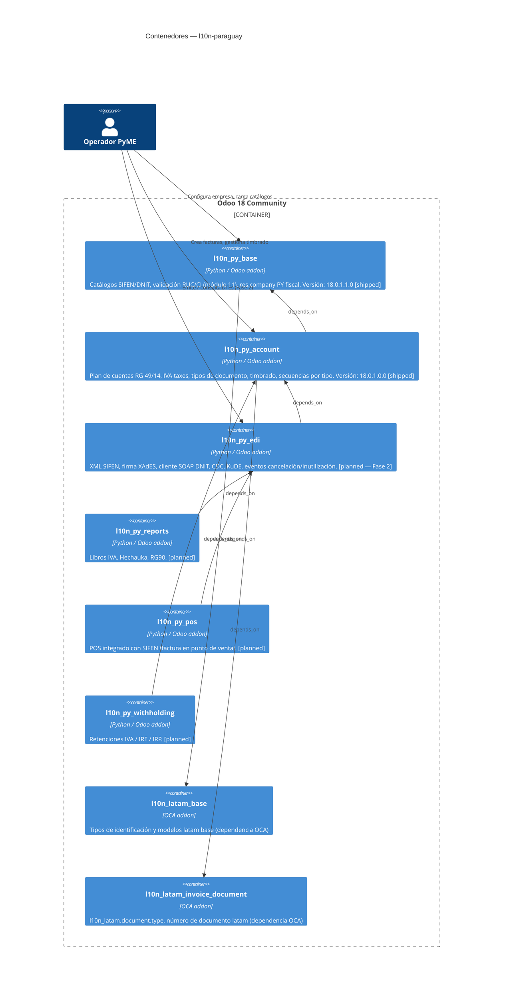
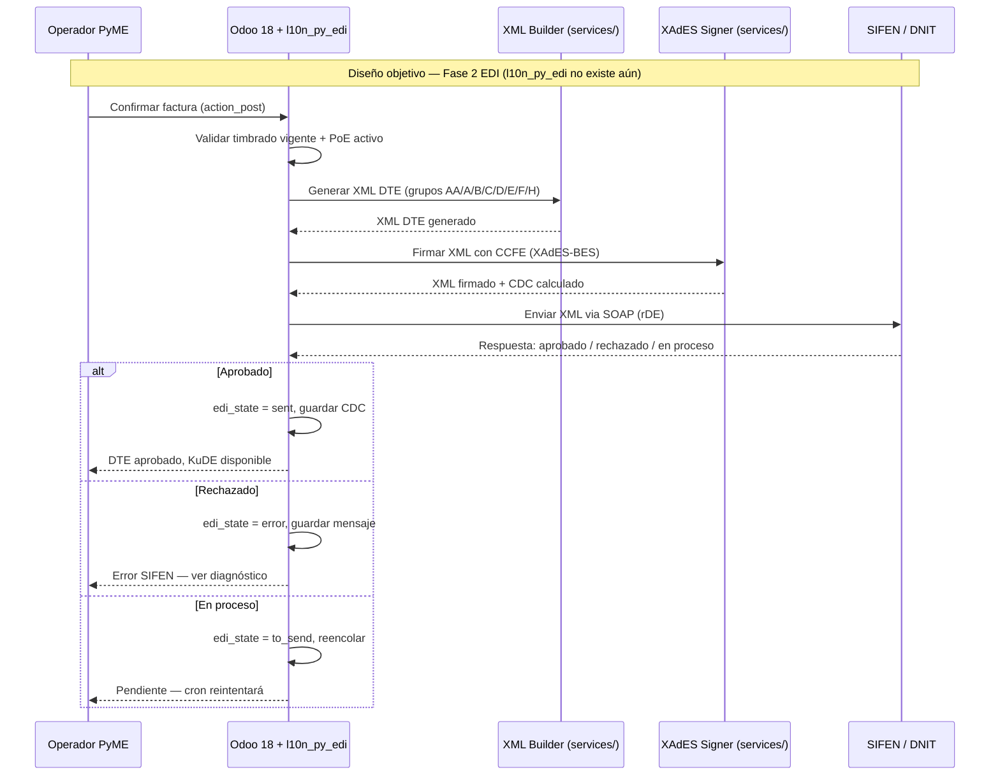
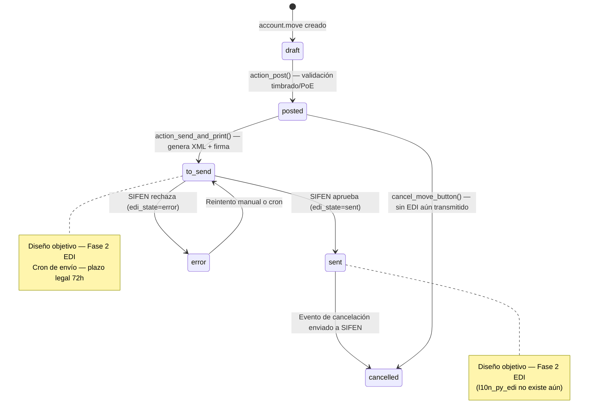

# Arquitectura — l10n-paraguay

**Estado:** diseño objetivo (Fase 2 EDI pending)
**Vigencia:** actualizar al mergear cada phase que cambie la arquitectura
**Cross-ref:** [`docs/50_MODULES_ROADMAP.md`](50_MODULES_ROADMAP.md) (módulos planned/shipped),
[`docs/03_DOMAIN_MODEL.md`](03_DOMAIN_MODEL.md) (modelo de dominio detallado)

---

## Alcance del documento

Este documento describe la arquitectura del sistema `l10n-paraguay` en dos
niveles: contexto (actores externos y sistemas) y contenedores (módulos y sus
dependencias). Los diagramas de emisión FE y ciclo de vida DTE están etiquetados
como **"diseño objetivo — Fase 2 EDI"** porque el módulo `l10n_py_edi` aún no
existe — sirven como especificación de entrada para esa fase.

Para el modelo de dominio detallado y los casos de uso, ver
[`docs/03_DOMAIN_MODEL.md`](03_DOMAIN_MODEL.md) y
[`docs/04_USE_CASES.md`](04_USE_CASES.md). Este documento es la vista de alto
nivel; no duplicar el detalle de esos docs.

---

## 1. Contexto del sistema (C4 Context)

---

## 2. Contenedores (C4 Container)

Los módulos `l10n_py_base` y `l10n_py_account` están **shipped** y en `main`.
Los cuatro módulos restantes son **planned** para Fase 2 y posteriores.

---

## 3. Secuencia de emisión FE (diseño objetivo — Fase 2 EDI)

> **Nota:** Este esquema describe el flujo **cuando `l10n_py_edi` exista**.
> Hoy el módulo no existe. Es la especificación de entrada para Fase 2 EDI.

---

## 4. Ciclo de vida del DTE (stateDiagram — diseño objetivo — Fase 2 EDI)

> **Nota:** Los estados `to_send`, `sent`, `error` y la transición de cancelación
> dependen de `l10n_py_edi` que se implementa en Fase 2. Los estados `draft` y
> `posted` ya existen en `account.move` estándar de Odoo.

---

## Cross-references

- Módulos planned/shipped: [`docs/50_MODULES_ROADMAP.md`](50_MODULES_ROADMAP.md)
- Modelo de dominio (detalle): [`docs/03_DOMAIN_MODEL.md`](03_DOMAIN_MODEL.md)
- Casos de uso: [`docs/04_USE_CASES.md`](04_USE_CASES.md)
- Modelo de datos: [`docs/05_DATA_MODEL.md`](05_DATA_MODEL.md)
- Deployment blueprint: [`docs/71_DEPLOYMENT.md`](71_DEPLOYMENT.md)
- Runbook operacional: [`docs/72_RUNBOOK.md`](72_RUNBOOK.md)

---

_Documento creado en Phase 3 Pre-Fase 2 (Bloque C Documentación operacional).
Próxima revisión: al comenzar Fase 2 EDI, actualizar estado de l10n_py_edi de
"planned" a "shipped" y validar los diagramas de secuencia y estado contra la
implementación real._
